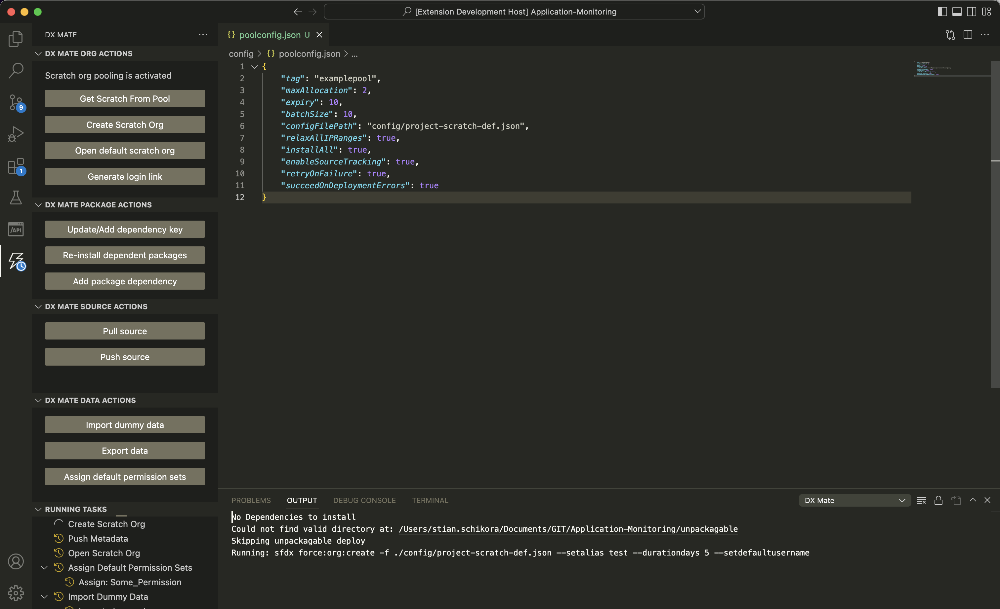
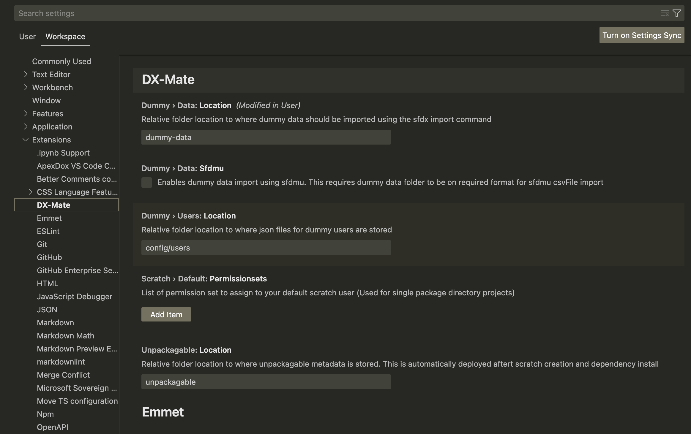
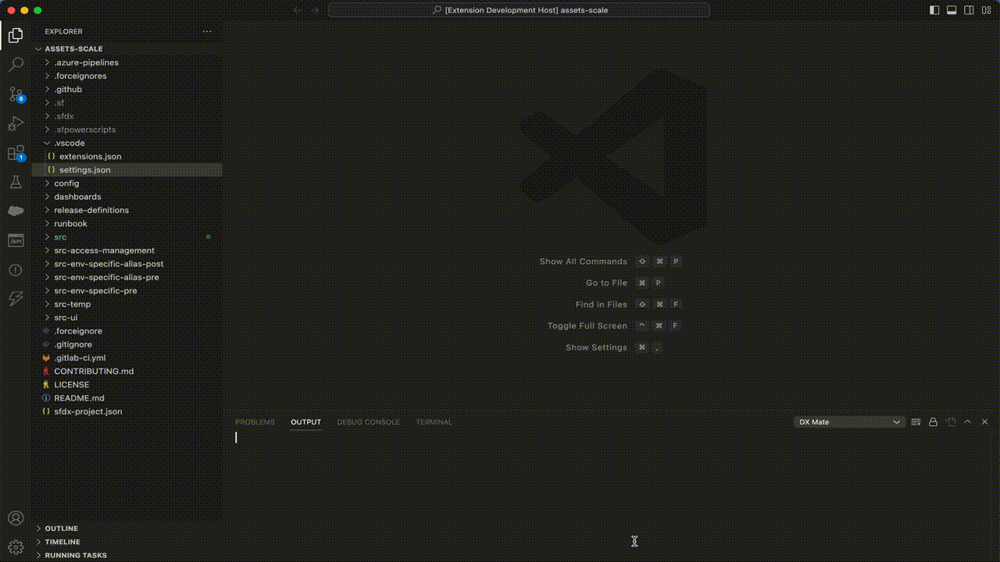

# DX-Mate

## Breaking change
From version 2.0.6 new dependencies need to be installed. See [Requirements](#requirements).

DX-Mate is an extension that provides a set of UI actions to improve SFDX development efficiency. Note, when installing a new version using [vsix](https://code.visualstudio.com/docs/editor/extension-marketplace#_install-from-a-vsix) the previous version should be uninstalled first.



## Features

Key features includes:
- Fetch scratch org from a pool
- Import dummy data to your scratch org using either sfdx data:tree:import or SFDMU
- Export data from a .soql file
- Create new scratch org
- Assign default permission sets
- Deploy unpackagable metadata
- Push/pull source
- Open scratch org

In addition the create scratch org command automatically chains the following actions:
1. Creating scratch org with alias as input
2. Installing package dependencies
3. Pushing project source to scratch org
4. Deploy unpackagable (For i.e. metadata that do not support packaging or should not be included in the package being developed)
5. Open scratch org
6. Assigning default permission sets
7. Importing dummy data

## Requirements

1. [Salesforce CLI](https://developer.salesforce.com/docs/atlas.en-us.sfdx_setup.meta/sfdx_setup/sfdx_setup_install_cli.htm)

```bash
npm install sfdx-cli --global #Needed for backwards compatability
npm install @salesforce/cli --global
```

2. sfpowerkit plugin
```bash
sfdx plugins:install sfpowerkit
```

Scratch org pooling is supported using DX-Mate and adheres to functionality from the [DX@Scale](https://docs.dxatscale.io/) framework. To activates these function your DebHub needs to have the unlocked package installed as described [here](https://docs.dxatscale.io/implementing-your-ci-cd/getting-started/getting-started-1#e-install-sfpowerscripts-scratch-org-pooling-unlocked-package-in-devhub). Also, run following commands to install dx@scale utilities and the sfdmu plugin:

```bash
npm i -g @dxatscale/sfpowerscripts 
sfdx plugins:install sfdmu  
```

Download the latest version of dxmate-x.x.x.vsix folder from https://github.com/Accenture/DX-Mate/releases.
Then open VS-Code and press F1 -> install from vsix.

## Extension Settings

This extension contributes the following settings:

* `dependency.keys`: Installation keys for all known dependencies only available in user settings
* `dummy.user.location`: Set the workspace relative directory for dummy users to create in scratch orgs
* `dummy.data.location`: Set the workspace relative directory for the dummy data
* `dummy.data.sfdmu`: Enable dummy data import using sfdmu plugin
* `unpackagable.location`: Set the workspace relative directory for unpackagable metadata
* `scratch.default.permissionsets`: Set the list of default permission sets to be assigned for the workspace
* `multi.scratch.default.permissionsets`: Set the list of default permission sets per package directory for the workspace

The settings can be located in the VS code ui by pressing <kbd>cmd</kbd> + <kbd>,</kbd> on mac or <kbd>Ctrl</kbd> + <kbd>,</kbd> on windows. Select workspace as the setting scope and findt DX-mate below extensions.



## Dummy data

To enable automatic import of dummy data after scratch org creation/fetch from org pool update the dummy data location setting and select whether dummy data is on the required [sfdmu format](https://help.sfdmu.com/get-started). For SFDMU import a single ``export.json`` file is required in the dummy data directory, along with x-amount of .csv files generated using the sfdmu export command.


